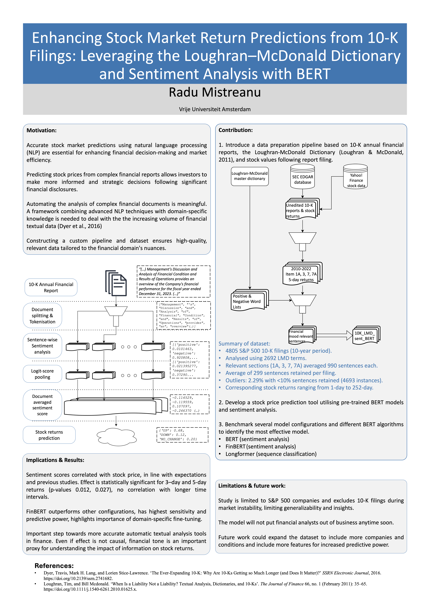

# 10K-LMD-FinBERT
Repository contains the code and data for the paper "Enhancing Stock Market Return Predictions from 10-K Filings: Leveraging the Loughran–McDonald Dictionary and Sentiment Analysis with BERT". The project introduces a novel NLP pipeline that integrates sentiment analysis using FinBERT to predict stock market returns from 10-K annual reports.
## Full paper
[📑 Enhancing Stock Market Return Predictions from 10-K Filings: Leveraging the Loughran–McDonald Dictionary and Sentiment Analysis with BERT (PDF)](Radu_Mistreanu_Bachelor_Thesis.pdf)
## Poster
 
